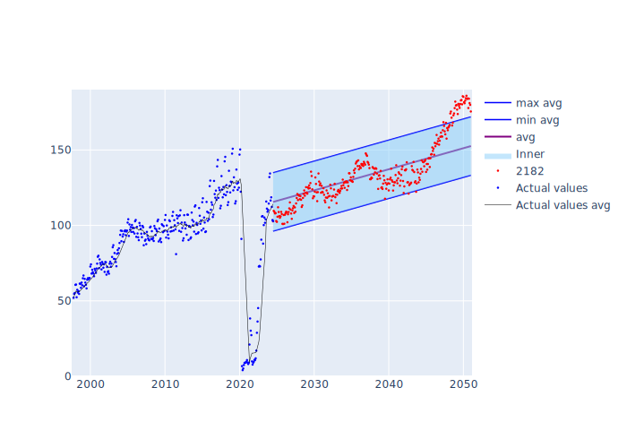
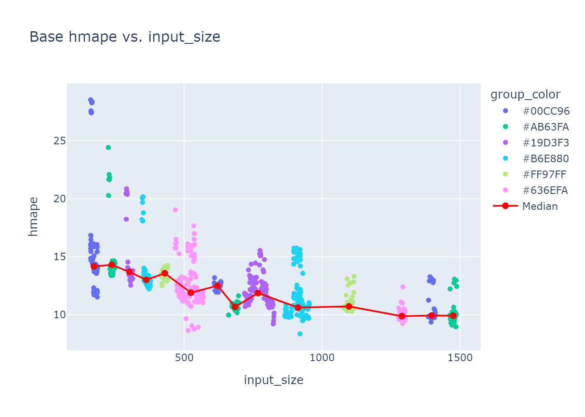

# Aviation demand forecasting
Forecasting monthly aviation fuel demand using machine learning
   

   
 
# Functionality

This code can be used for forecasting aviation fuel demand with monthly resolution.
Machine learning models can be trained using varying input data to analyze different scenarios.

# Documentation

The script **pipeline.py** can be used to access the whole pipeline of the forecast.
Parameters can be adjusted for every step of the pipeline, with the option to train new models from scratch.
To run the pipeline, clone the repo. The pipeline needs the given folder structure and containing files to run.

## Scripts
### **Train_model_script**
  - Takes a set of values for each model parameter
  - Each possible set of parameters generates one model
  - Saves models to disc, model information to summary excel file
### **sbs_model_train_script**
  - Takes models and adds covid data using partial training with varying intensities ('Covid impacts')
  - Each covid impact generates one new sbs model (covid impact model)
### **long_term_model_script**
  - Takes models (base or sbs) to create long term forecast
### **average_impact_plot**
  - Calculates average feature impact to find optimal number of rolled features
### **calc_shap_script**
  - Calculates feature importance (or impact) given one model
### **extract_features**
  - Extracts tsfresh features from raw time series
### **forecast_plot**
  - Plots long term forecast including averages using linear regression from multiple model forecasts
  
### **hmape_covid_impact_plot**
  - Plots the error over varying covid impacts
### **hmape_input_size_plot**
  - Plots the error over varying input sizes
  
### **move_files**
  - Used to copy multiple model files
### **start_script_train**, **start_script_sbs**
  - To avoid memory hog, these scripts are used to restart train scripts if many models are trained at once
